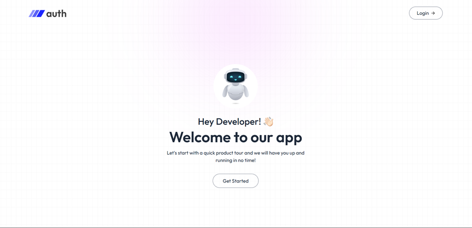
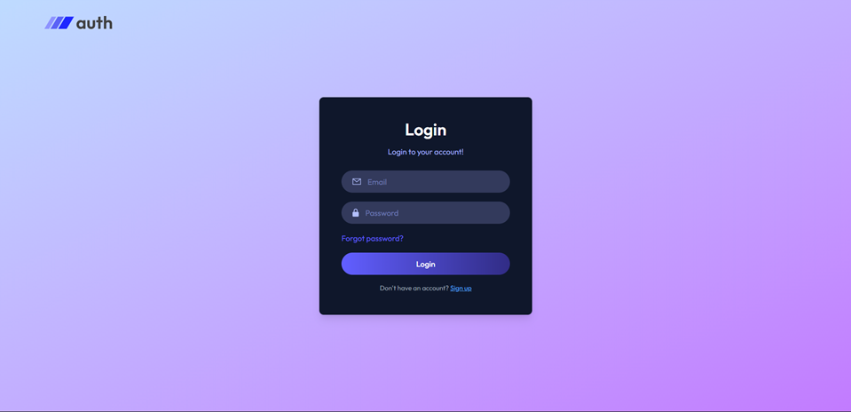
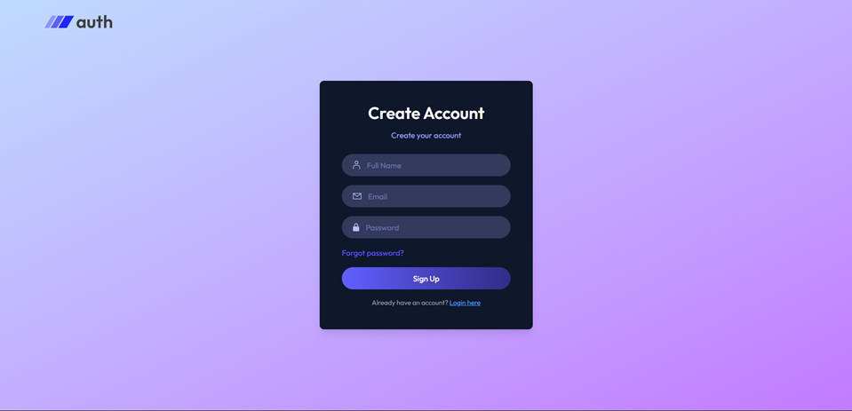
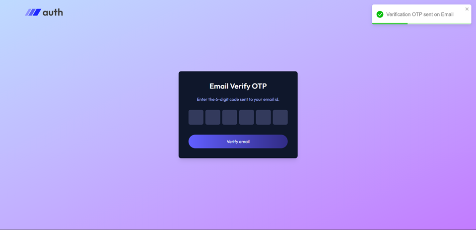
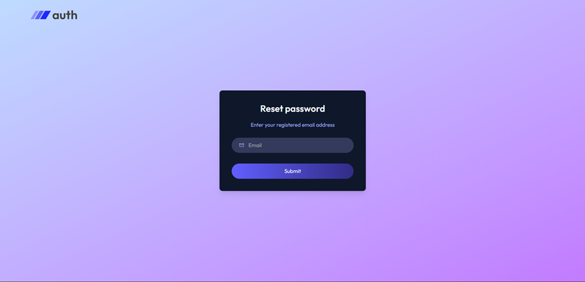

# 🔐 MERN Authentication System


---

## ✨ Project Overview

A complete and secure user authentication system built using the **MERN stack** (MongoDB, Express, React, Node.js). This project focuses on robust security practices and provides a seamless user experience with features like JWT authentication using HttpOnly cookies, email verification via OTP, and a secure password reset flow.

---

## 🚀 Features

* **User Authentication:** Secure Sign Up and Login functionality with robust validation.
* **Email Verification:** Users verify their accounts via a 6-digit OTP sent to their registered email address.
* **Password Reset:** A secure "Forgot Password" flow utilizing OTPs for secure password resets.
* **Enhanced Security:**
    * Password encryption using `bcryptjs` for maximum protection.
    * JWT (JSON Web Tokens) for secure, stateless authentication.
    * `HttpOnly` Cookies to store JWT tokens securely, mitigating XSS attacks.
    * Route protection via middleware to restrict access to authenticated users.
* **Intuitive User Interface:**
    * Responsive design powered by `Tailwind CSS` for a consistent experience across devices.
    * `React Toastify` for elegant and informative success/error notifications.
    * Dynamic Profile Icon displaying the user's initial for a personalized touch.

---

## 📸 Screenshots

A glimpse of the application in action:


| Homepage | Login | Signup |
|---|---|---|
|  |  |  |

| Email Verification | Password Reset |
|---|---|
|  |  |


---

## 🛠️ Tech Stack

### Frontend
* **React (Vite):** A fast and efficient library for building user interfaces.
* **Tailwind CSS:** A utility-first CSS framework for rapid UI development and responsive design.
* **Axios:** Promise-based HTTP client for making API requests.
* **React Router Dom:** Declarative routing for React applications.
* **React Toastify:** For elegant and customizable toast notifications.

### Backend
* **Node.js & Express.js:** A robust and flexible backend framework.
* **MongoDB (Mongoose):** NoSQL database with an elegant ODM for Node.js.
* **JsonWebToken (JWT):** For creating and verifying secure authentication tokens.
* **Bcrypt.js:** Library for hashing passwords securely.
* **Nodemailer:** Module for sending emails (e.g., OTPs, password reset links).
* **Cookie-Parser:** Middleware to parse Cookie headers.
* **Cors:** Middleware to enable Cross-Origin Resource Sharing.

---

## 📂 Project Structure

The project is thoughtfully organized into two main folders for clear separation of concerns:

* `client/`: Contains the complete frontend React application.
* `server/`: Contains the backend Node.js/Express API.

---

## ⚙️ Installation & Setup

Follow these steps to get the project up and running on your local machine.

### 1. Backend Setup

1.  Navigate into the `server` directory:
    ```bash
    cd server
    ```
2.  Install all required backend dependencies:
    ```bash
    npm install
    ```
3.  Create a `.env` file in the `server` folder and add the following environment variables. Replace placeholders with your actual values:
    ```ini
    PORT=4000
    MONGODB_URI=your_mongodb_connection_string
    JWT_SECRET=a_very_long_and_random_secret_key
    CLIENT_URL=http://localhost:5173 # Or your client's actual URL
    # Email Configuration for Nodemailer
    SMTP_HOST=smtp.example.com # e.g., smtp.brevo.com, smtp.gmail.com
    SMTP_PORT=587 # or 465 for SSL
    SMTP_USER=your_email@example.com
    SMTP_PASS=your_email_password_or_app_specific_password
    SENDER_EMAIL=your_sender_email@example.com
    ```
    **Note:** For `SMTP_PASS` with Gmail, you'll need to generate an App Password, as direct password usage is often blocked.
4.  Start the backend server (uses `Nodemon` for automatic restarts during development):
    ```bash
    npm run dev
    ```
    The server should now be running on `http://localhost:4000`.

### 2. Frontend Setup

1.  Open a new terminal and navigate into the `client` directory:
    ```bash
    cd client
    ```
2.  Install all required frontend dependencies:
    ```bash
    npm install
    ```
3.  Create a `.env` file in the `client` folder with the backend URL:
    ```ini
    VITE_BACKEND_URL=http://localhost:4000
    ```
4.  Start the frontend application:
    ```bash
    npm run dev
    ```
    The app will generally run on `http://localhost:5173` (or another port if 5173 is in use).

---

## 🔌 API Endpoints

The backend exposes a comprehensive set of RESTful API endpoints:

| Method | Endpoint                    | Description                           | Authentication Required |
| :----- | :-------------------------- | :------------------------------------ | :---------------------- |
| `POST` | `/api/auth/register`        | Register a new user                   | No                      |
| `POST` | `/api/auth/login`           | Login user and set HttpOnly cookie    | No                      |
| `POST` | `/api/auth/logout`          | Logout user and clear cookies         | Yes                     |
| `GET`  | `/api/auth/is-auth`         | Check if the user is authenticated    | Yes                     |
| `POST` | `/api/auth/send-verify-otp` | Send verification OTP to email        | No                      |
| `POST` | `/api/auth/verify-account`  | Verify email using the received OTP   | No                      |
| `POST` | `/api/auth/send-reset-otp`  | Send password reset OTP               | No                      |
| `POST` | `/api/auth/reset-password`  | Reset password using OTP & new password | No                      |
| `GET`  | `/api/user/data`            | Retrieve authenticated user details   | Yes                     |

---

## 📧 Email Configuration

This project utilizes `Nodemailer` to send transactional emails for account verification and password resets. You can configure it to use various SMTP services such as Brevo (formerly Sendinblue), Gmail, Outlook, or others.

**Important:** Ensure you update the `SMTP_HOST`, `SMTP_PORT`, `SMTP_USER`, `SMTP_PASS`, and `SENDER_EMAIL` variables in your backend `.env` file with your chosen email service's credentials.

---

## 🤝 Contributing

Contributions are welcome! If you have suggestions for improvements or new features, please open an issue or submit a pull request.

---

## 📄 License

This project is licensed under the MIT License - see the [LICENSE](LICENSE) file for details.

---

## 🙏 Acknowledgments

* [Node.js](https://nodejs.org/)
* [React](https://react.dev/)
* [Express](https://expressjs.com/)
* [MongoDB](https://www.mongodb.com/)
* [Tailwind CSS](https://tailwindcss.com/)